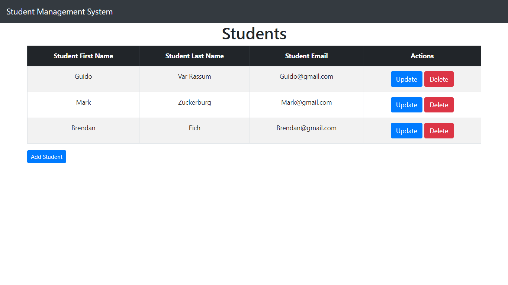
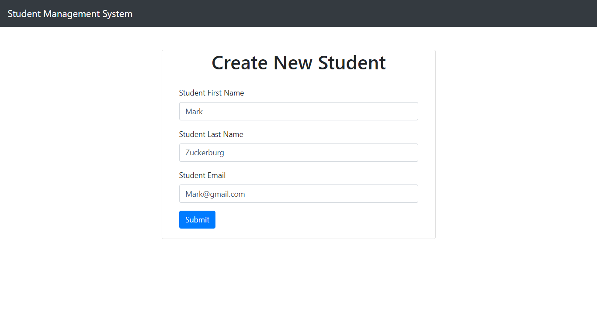
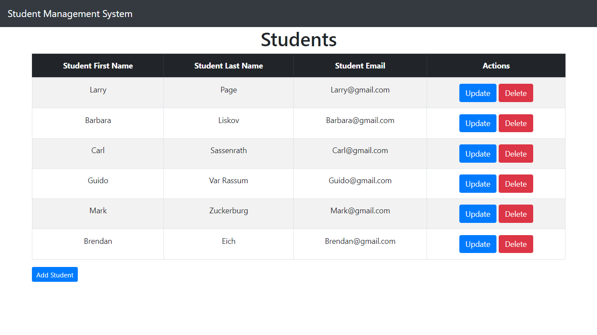

# Student-Management-System-CRUD

## Tools and Technologies Used
Java 16
Spring Boot
Spring MVC
Spring Data JPA ( Hibernate)
MySQL
Thymeleaf
Eclipse STS

## 1. Create Spring Boot Project
Let's open STS ( Spring Suite Tool) IDE to develop and bootstrap the Spring boot project.

Use the below guide to create a Spring boot project in Eclipse STS IDE: 
=> Create Spring Boot Project in Spring Tool Suite [STS]

Selected below dependencies while creating spring boot project using spring initializr:
- Spring Web
- Thymeleaf
- Spring Data JPA
- MySQL Driver
- Spring Boot Devtools

## 2. Create Spring Boot Project Structure
Creating the below packages in our Spring boot project:
- controller
- service
- repository
- entity
## 3. Maven Dependencies
After creating the spring boot project, verify pom.xml with the pom.xml file

## 3. Create Student JPA Entity
Creating a Student JPA entity under the entity package
@Entity - This annotation specifies that the class is an entity. This annotation can be applied to Class, Interface of Enums.
@Table  - JPA annotation specifies the table in the database with which this entity is mapped.
@Id - The @Id JPA annotation specifies the primary key of the entity.
@Column - The @Column annotation is used to specify the mapping between a basic entity attribute and the database table column.

## 4. Create JPA StudentRepository
Creating a StudentRepository interface under the repository package

## 5. Configure MySQL Database
Before configuring the MySQL database configuration in our Spring boot project, first, create a database named SMS in MySQL workbench:
create database sms
 Adding some properties in the application.properties file

 ## 6. Creating Service Layer
StudentService Interface
Creating a StudentService interface under the service package and adding some contents in it.

## StudentServiceImpl Class
Creating a new package called impl inside the service package. Creating StudentServiceImpl class and adding some contents in it.

## 7. Controller Layer
Creating a StudentController class and adding some contents in it.

## 8. View Layer
resources/templates/students.html
Creating a students.html file and adding some contents in it.

We have used th:each Thymeleaf attribute in our template to iterate the list of students:
resources/templates/create_student.html
Creating a create_student.html file and adding some contents to it.

resources/templates/edit_student.html
Creating an edit_student.html file and adding some contents to it.

## 9. Run Spring Boot Application
Run the Spring boot application with the main class.

## List of Students

## Add Students

## List of Students with update, delete and add students options

